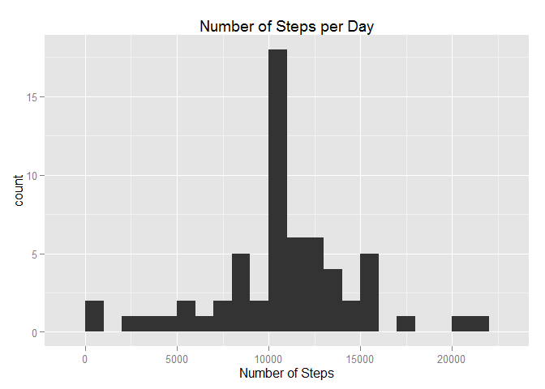
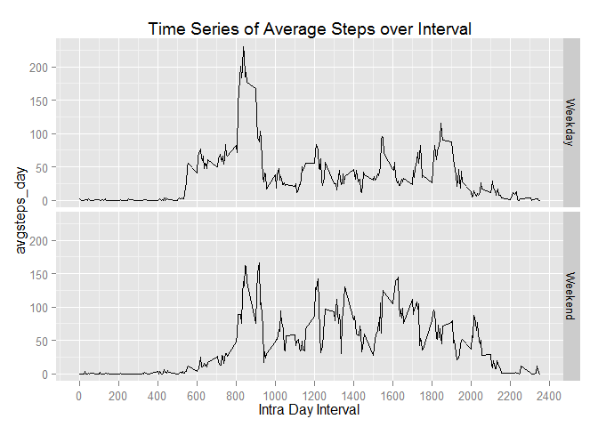

# Reproducible Research: Peer Assessment 1

## Setup  

Set the working directory, check and set directories, check and load packages,
load libraries.  

```r
setwd("~/GitHub/RepData_PeerAssessment1")

# check for directories and create if needed
if (!file.exists("data")) {
  dir.create("data")
}

if (!file.exists("figures")) {
  dir.create("figures")
}

# Check and load packages

install_required_libs<-function() {
    for(i in 1:length(required_lib)) {
        if(required_lib[i] %in% rownames(installed.packages()) == FALSE) {
            install.packages(required_lib[i])                            }
        library(required_lib[i], character.only = TRUE)
                                     }
                                  }

required_lib =c("ggplot2","ggvis","dplyr")

install_required_libs()
```

```
## 
## Attaching package: 'ggvis'
## 
## The following object is masked from 'package:ggplot2':
## 
##     resolution
## 
## The following object is masked from 'package:stats':
## 
##     filter
## 
## 
## Attaching package: 'dplyr'
## 
## The following objects are masked from 'package:stats':
## 
##     filter, lag
## 
## The following objects are masked from 'package:base':
## 
##     intersect, setdiff, setequal, union
```
## Loading and preprocessing the data

* Show any code that is needed to Load the data (i.e. read.csv())  

* Process/transform the data (if necessary) into a format suitable for your analysis  


```r
a_data <- read.csv(file="./data/activity.csv",header=TRUE,fill=TRUE)

str(a_data)
```

```
## 'data.frame':	17568 obs. of  3 variables:
##  $ steps   : int  NA NA NA NA NA NA NA NA NA NA ...
##  $ date    : Factor w/ 61 levels "2012-10-01","2012-10-02",..: 1 1 1 1 1 1 1 1 1 1 ...
##  $ interval: int  0 5 10 15 20 25 30 35 40 45 ...
```

```r
summary(a_data)
```

```
##      steps               date          interval   
##  Min.   :  0.0   2012-10-01:  288   Min.   :   0  
##  1st Qu.:  0.0   2012-10-02:  288   1st Qu.: 589  
##  Median :  0.0   2012-10-03:  288   Median :1178  
##  Mean   : 37.4   2012-10-04:  288   Mean   :1178  
##  3rd Qu.: 12.0   2012-10-05:  288   3rd Qu.:1766  
##  Max.   :806.0   2012-10-06:  288   Max.   :2355  
##  NA's   :2304    (Other)   :15840
```

```r
# transform data

a_data$date <- as.Date(a_data$date, "%Y-%m-%d")
summary(a_data)
```

```
##      steps            date               interval   
##  Min.   :  0.0   Min.   :2012-10-01   Min.   :   0  
##  1st Qu.:  0.0   1st Qu.:2012-10-16   1st Qu.: 589  
##  Median :  0.0   Median :2012-10-31   Median :1178  
##  Mean   : 37.4   Mean   :2012-10-31   Mean   :1178  
##  3rd Qu.: 12.0   3rd Qu.:2012-11-15   3rd Qu.:1766  
##  Max.   :806.0   Max.   :2012-11-30   Max.   :2355  
##  NA's   :2304
```
## What is mean total number of steps taken per day?  

For this part of the assignment, you can ignore the missing values in the  
dataset.  

* Make a histogram of the total number of steps taken each day  

* Calculate and report the mean and median total number of steps taken per day  


```r
# Use dplyr and ggvis to group and display histogram of total steps
steps <- 
a_data %>%
  group_by(date) %>%
  summarize(nsteps = sum(steps)) %>%
  ggvis(~nsteps) %>%
  layer_histograms(binwidth = 1000) %>%
  add_axis("x", title = "Number of Steps Taken") %>%
  add_axis("x", orient = "top", ticks = 0, title = "Histogram of Steps Taken per Day",
           properties = axis_props(
             axis = list(stroke = "white"),
             labels = list(fontSize = 0)))
```

```
## compute_bin: NA values ignored for binning.
```

```r
steps
```

<!--html_preserve--><div id="plot_id111995639-container" class="ggvis-output-container">
<div id="plot_id111995639" class="ggvis-output"></div>
<div class="plot-gear-icon">
<nav class="ggvis-control">
<a class="ggvis-dropdown-toggle" title="Controls" onclick="return false;"></a>
<ul class="ggvis-dropdown">
<li>
Renderer: 
<a id="plot_id111995639_renderer_svg" class="ggvis-renderer-button" onclick="return false;" data-plot-id="plot_id111995639" data-renderer="svg">SVG</a>
 | 
<a id="plot_id111995639_renderer_canvas" class="ggvis-renderer-button" onclick="return false;" data-plot-id="plot_id111995639" data-renderer="canvas">Canvas</a>
</li>
<li>
<a id="plot_id111995639_download" class="ggvis-download" data-plot-id="plot_id111995639">Download</a>
</li>
</ul>
</nav>
</div>
</div>
<script type="text/javascript">
var plot_id111995639_spec = {
	"data" : [
		{
			"name" : "a_data %&gt;% group_by(date) %&gt;% summarize(nsteps = sum(steps))0/bin1/stack2",
			"format" : {
				"type" : "csv",
				"parse" : {
					"xmin_" : "number",
					"xmax_" : "number",
					"stack_upr_" : "number",
					"stack_lwr_" : "number"
				}
			},
			"values" : "\"xmin_\",\"xmax_\",\"stack_upr_\",\"stack_lwr_\"\n0,1000,2,0\n1000,2000,0,0\n2000,3000,1,0\n3000,4000,1,0\n4000,5000,1,0\n5000,6000,2,0\n6000,7000,1,0\n7000,8000,2,0\n8000,9000,5,0\n9000,10000,2,0\n10000,11000,10,0\n11000,12000,6,0\n12000,13000,6,0\n13000,14000,4,0\n14000,15000,2,0\n15000,16000,5,0\n16000,17000,0,0\n17000,18000,1,0\n18000,19000,0,0\n19000,20000,0,0\n20000,21000,1,0\n21000,22000,1,0"
		},
		{
			"name" : "scale/x",
			"format" : {
				"type" : "csv",
				"parse" : {
					"domain" : "number"
				}
			},
			"values" : "\"domain\"\n-1100\n23100"
		},
		{
			"name" : "scale/y",
			"format" : {
				"type" : "csv",
				"parse" : {
					"domain" : "number"
				}
			},
			"values" : "\"domain\"\n0\n10.5"
		}
	],
	"scales" : [
		{
			"name" : "x",
			"domain" : {
				"data" : "scale/x",
				"field" : "data.domain"
			},
			"zero" : false,
			"nice" : false,
			"clamp" : false,
			"range" : "width"
		},
		{
			"name" : "y",
			"domain" : {
				"data" : "scale/y",
				"field" : "data.domain"
			},
			"zero" : false,
			"nice" : false,
			"clamp" : false,
			"range" : "height"
		}
	],
	"marks" : [
		{
			"type" : "rect",
			"properties" : {
				"update" : {
					"stroke" : {
						"value" : "#000000"
					},
					"fill" : {
						"value" : "#333333"
					},
					"x" : {
						"scale" : "x",
						"field" : "data.xmin_"
					},
					"x2" : {
						"scale" : "x",
						"field" : "data.xmax_"
					},
					"y" : {
						"scale" : "y",
						"field" : "data.stack_upr_"
					},
					"y2" : {
						"scale" : "y",
						"field" : "data.stack_lwr_"
					}
				},
				"ggvis" : {
					"data" : {
						"value" : "a_data %&gt;% group_by(date) %&gt;% summarize(nsteps = sum(steps))0/bin1/stack2"
					}
				}
			},
			"from" : {
				"data" : "a_data %&gt;% group_by(date) %&gt;% summarize(nsteps = sum(steps))0/bin1/stack2"
			}
		}
	],
	"width" : 672,
	"height" : 480,
	"legends" : [],
	"axes" : [
		{
			"type" : "x",
			"scale" : "x",
			"orient" : "bottom",
			"title" : "Number of Steps Taken",
			"layer" : "back",
			"grid" : true
		},
		{
			"type" : "x",
			"scale" : "x",
			"orient" : "top",
			"title" : "Histogram of Steps Taken per Day",
			"ticks" : 0,
			"layer" : "back",
			"grid" : true,
			"properties" : {
				"labels" : {
					"fontSize" : {
						"value" : 0
					}
				},
				"axis" : {
					"stroke" : {
						"value" : "white"
					}
				}
			}
		},
		{
			"type" : "y",
			"scale" : "y",
			"orient" : "left",
			"layer" : "back",
			"grid" : true,
			"title" : "count"
		}
	],
	"padding" : null,
	"ggvis_opts" : {
		"keep_aspect" : false,
		"resizable" : true,
		"padding" : {},
		"duration" : 250,
		"renderer" : "svg",
		"hover_duration" : 0,
		"width" : 672,
		"height" : 480
	},
	"handlers" : null
};
ggvis.getPlot("plot_id111995639").parseSpec(plot_id111995639_spec);
</script><!--/html_preserve-->

```r
steps_plot <-
a_data %>%
  group_by(date) %>%
  summarize(nsteps = sum(steps)) %>%
  ggplot(aes(x=nsteps)) + geom_histogram(binwidth = 1000)

steps_plot + labs(title="Number of Steps per Day", x= "Number of Steps")
```

 

```r
#Place plot in figures directory
#not necessary with correct options
# png(file = "./figures/rrpa1_hist1.png")
# 
# steps_plot <-
# a_data %>%
#   group_by(date) %>%
#   summarize(nsteps = sum(steps)) %>%
#   ggplot(aes(x=nsteps)) + 
#     geom_histogram(binwidth = 1000) +
#     labs(title="Number of Steps per Day", x= "Number of Steps")
# 
# steps_plot
# 
# dev.off()
```

```r
# group data by day summing steps
meansteps <-
    a_data %>%
    group_by(date) %>%
    summarize(nsteps = sum(steps))

# find mean and median number of steps by day
meansteps
```

```
## Source: local data frame [61 x 2]
## 
##          date nsteps
## 1  2012-10-01     NA
## 2  2012-10-02    126
## 3  2012-10-03  11352
## 4  2012-10-04  12116
## 5  2012-10-05  13294
## 6  2012-10-06  15420
## 7  2012-10-07  11015
## 8  2012-10-08     NA
## 9  2012-10-09  12811
## 10 2012-10-10   9900
## 11 2012-10-11  10304
## 12 2012-10-12  17382
## 13 2012-10-13  12426
## 14 2012-10-14  15098
## 15 2012-10-15  10139
## 16 2012-10-16  15084
## 17 2012-10-17  13452
## 18 2012-10-18  10056
## 19 2012-10-19  11829
## 20 2012-10-20  10395
## 21 2012-10-21   8821
## 22 2012-10-22  13460
## 23 2012-10-23   8918
## 24 2012-10-24   8355
## 25 2012-10-25   2492
## 26 2012-10-26   6778
## 27 2012-10-27  10119
## 28 2012-10-28  11458
## 29 2012-10-29   5018
## 30 2012-10-30   9819
## 31 2012-10-31  15414
## 32 2012-11-01     NA
## 33 2012-11-02  10600
## 34 2012-11-03  10571
## 35 2012-11-04     NA
## 36 2012-11-05  10439
## 37 2012-11-06   8334
## 38 2012-11-07  12883
## 39 2012-11-08   3219
## 40 2012-11-09     NA
## 41 2012-11-10     NA
## 42 2012-11-11  12608
## 43 2012-11-12  10765
## 44 2012-11-13   7336
## 45 2012-11-14     NA
## 46 2012-11-15     41
## 47 2012-11-16   5441
## 48 2012-11-17  14339
## 49 2012-11-18  15110
## 50 2012-11-19   8841
## 51 2012-11-20   4472
## 52 2012-11-21  12787
## 53 2012-11-22  20427
## 54 2012-11-23  21194
## 55 2012-11-24  14478
## 56 2012-11-25  11834
## 57 2012-11-26  11162
## 58 2012-11-27  13646
## 59 2012-11-28  10183
## 60 2012-11-29   7047
## 61 2012-11-30     NA
```

```r
ms <- mean(meansteps$nsteps,na.rm=TRUE)
med <- median(meansteps$nsteps,na.rm=TRUE)

ms
```

```
## [1] 10766
```

```r
med
```

```
## [1] 10765
```
The mean number of steps taken per day is **10766** and the median 
number of steps taken per day is **10765**.  

## What is the average daily activity pattern?

Make a time series plot (i.e. type = "l") of the 5-minute interval (x-axis)  
and the average number of steps taken, averaged across all days (y-axis)  

Which 5-minute interval, on average across all the days in the dataset,  
contains the maximum number of steps?  

```r
# Find and remove NA rows

sum(is.na(a_data))
```

```
## [1] 2304
```

```r
for (i in 1:ncol(a_data)) {
  print(names(a_data)[i]);print(sum(is.na(a_data[,i])))
}
```

```
## [1] "steps"
## [1] 2304
## [1] "date"
## [1] 0
## [1] "interval"
## [1] 0
```

```r
bad_steps <- is.na(a_data$steps)
ga_data <- a_data[!bad_steps,]

summary(a_data)
```

```
##      steps            date               interval   
##  Min.   :  0.0   Min.   :2012-10-01   Min.   :   0  
##  1st Qu.:  0.0   1st Qu.:2012-10-16   1st Qu.: 589  
##  Median :  0.0   Median :2012-10-31   Median :1178  
##  Mean   : 37.4   Mean   :2012-10-31   Mean   :1178  
##  3rd Qu.: 12.0   3rd Qu.:2012-11-15   3rd Qu.:1766  
##  Max.   :806.0   Max.   :2012-11-30   Max.   :2355  
##  NA's   :2304
```

```r
summary(ga_data)
```

```
##      steps            date               interval   
##  Min.   :  0.0   Min.   :2012-10-02   Min.   :   0  
##  1st Qu.:  0.0   1st Qu.:2012-10-16   1st Qu.: 589  
##  Median :  0.0   Median :2012-10-29   Median :1178  
##  Mean   : 37.4   Mean   :2012-10-30   Mean   :1178  
##  3rd Qu.: 12.0   3rd Qu.:2012-11-16   3rd Qu.:1766  
##  Max.   :806.0   Max.   :2012-11-29   Max.   :2355
```

```r
inter <-
    ga_data %>%
    group_by(interval) %>%
    summarize(avgsteps = mean(steps)) %>%
    ggvis(~interval,~avgsteps) %>%
    layer_paths()

inter
```

<!--html_preserve--><div id="plot_id937990133-container" class="ggvis-output-container">
<div id="plot_id937990133" class="ggvis-output"></div>
<div class="plot-gear-icon">
<nav class="ggvis-control">
<a class="ggvis-dropdown-toggle" title="Controls" onclick="return false;"></a>
<ul class="ggvis-dropdown">
<li>
Renderer: 
<a id="plot_id937990133_renderer_svg" class="ggvis-renderer-button" onclick="return false;" data-plot-id="plot_id937990133" data-renderer="svg">SVG</a>
 | 
<a id="plot_id937990133_renderer_canvas" class="ggvis-renderer-button" onclick="return false;" data-plot-id="plot_id937990133" data-renderer="canvas">Canvas</a>
</li>
<li>
<a id="plot_id937990133_download" class="ggvis-download" data-plot-id="plot_id937990133">Download</a>
</li>
</ul>
</nav>
</div>
</div>
<script type="text/javascript">
var plot_id937990133_spec = {
	"data" : [
		{
			"name" : "ga_data %&gt;% group_by(interval) %&gt;% summarize(avgsteps = mean(steps))0",
			"format" : {
				"type" : "csv",
				"parse" : {
					"interval" : "number",
					"avgsteps" : "number"
				}
			},
			"values" : "\"interval\",\"avgsteps\"\n0,1.71698113207547\n5,0.339622641509434\n10,0.132075471698113\n15,0.150943396226415\n20,0.0754716981132075\n25,2.09433962264151\n30,0.528301886792453\n35,0.867924528301887\n40,0\n45,1.47169811320755\n50,0.30188679245283\n55,0.132075471698113\n100,0.320754716981132\n105,0.679245283018868\n110,0.150943396226415\n115,0.339622641509434\n120,0\n125,1.11320754716981\n130,1.83018867924528\n135,0.169811320754717\n140,0.169811320754717\n145,0.377358490566038\n150,0.264150943396226\n155,0\n200,0\n205,0\n210,1.13207547169811\n215,0\n220,0\n225,0.132075471698113\n230,0\n235,0.226415094339623\n240,0\n245,0\n250,1.54716981132075\n255,0.943396226415094\n300,0\n305,0\n310,0\n315,0\n320,0.207547169811321\n325,0.622641509433962\n330,1.62264150943396\n335,0.584905660377358\n340,0.490566037735849\n345,0.0754716981132075\n350,0\n355,0\n400,1.18867924528302\n405,0.943396226415094\n410,2.56603773584906\n415,0\n420,0.339622641509434\n425,0.358490566037736\n430,4.11320754716981\n435,0.660377358490566\n440,3.49056603773585\n445,0.830188679245283\n450,3.11320754716981\n455,1.11320754716981\n500,0\n505,1.56603773584906\n510,3\n515,2.24528301886792\n520,3.32075471698113\n525,2.9622641509434\n530,2.09433962264151\n535,6.05660377358491\n540,16.0188679245283\n545,18.3396226415094\n550,39.4528301886792\n555,44.4905660377358\n600,31.4905660377358\n605,49.2641509433962\n610,53.7735849056604\n615,63.4528301886792\n620,49.9622641509434\n625,47.0754716981132\n630,52.1509433962264\n635,39.3396226415094\n640,44.0188679245283\n645,44.1698113207547\n650,37.3584905660377\n655,49.0377358490566\n700,43.811320754717\n705,44.377358490566\n710,50.5094339622642\n715,54.5094339622642\n720,49.9245283018868\n725,50.9811320754717\n730,55.6792452830189\n735,44.3207547169811\n740,52.2641509433962\n745,69.5471698113208\n750,57.8490566037736\n755,56.1509433962264\n800,73.377358490566\n805,68.2075471698113\n810,129.433962264151\n815,157.528301886792\n820,171.150943396226\n825,155.396226415094\n830,177.301886792453\n835,206.169811320755\n840,195.924528301887\n845,179.566037735849\n850,183.396226415094\n855,167.018867924528\n900,143.452830188679\n905,124.037735849057\n910,109.11320754717\n915,108.11320754717\n920,103.716981132075\n925,95.9622641509434\n930,66.2075471698113\n935,45.2264150943396\n940,24.7924528301887\n945,38.7547169811321\n950,34.9811320754717\n955,21.0566037735849\n1000,40.5660377358491\n1005,26.9811320754717\n1010,42.4150943396226\n1015,52.6603773584906\n1020,38.9245283018868\n1025,50.7924528301887\n1030,44.2830188679245\n1035,37.4150943396226\n1040,34.6981132075472\n1045,28.3396226415094\n1050,25.0943396226415\n1055,31.9433962264151\n1100,31.3584905660377\n1105,29.6792452830189\n1110,21.3207547169811\n1115,25.5471698113208\n1120,28.377358490566\n1125,26.4716981132075\n1130,33.4339622641509\n1135,49.9811320754717\n1140,42.0377358490566\n1145,44.6037735849057\n1150,46.0377358490566\n1155,59.188679245283\n1200,63.8679245283019\n1205,87.6981132075472\n1210,94.8490566037736\n1215,92.7735849056604\n1220,63.3962264150943\n1225,50.1698113207547\n1230,54.4716981132075\n1235,32.4150943396226\n1240,26.5283018867925\n1245,37.7358490566038\n1250,45.0566037735849\n1255,67.2830188679245\n1300,42.3396226415094\n1305,39.8867924528302\n1310,43.2641509433962\n1315,40.9811320754717\n1320,46.2452830188679\n1325,56.4339622641509\n1330,42.7547169811321\n1335,25.1320754716981\n1340,39.9622641509434\n1345,53.5471698113208\n1350,47.3207547169811\n1355,60.811320754717\n1400,55.7547169811321\n1405,51.9622641509434\n1410,43.5849056603774\n1415,48.6981132075472\n1420,35.4716981132075\n1425,37.5471698113208\n1430,41.8490566037736\n1435,27.5094339622642\n1440,17.1132075471698\n1445,26.0754716981132\n1450,43.622641509434\n1455,43.7735849056604\n1500,30.0188679245283\n1505,36.0754716981132\n1510,35.4905660377358\n1515,38.8490566037736\n1520,45.9622641509434\n1525,47.7547169811321\n1530,48.1320754716981\n1535,65.3207547169811\n1540,82.9056603773585\n1545,98.6603773584906\n1550,102.11320754717\n1555,83.9622641509434\n1600,62.1320754716981\n1605,64.1320754716981\n1610,74.5471698113208\n1615,63.1698113207547\n1620,56.9056603773585\n1625,59.7735849056604\n1630,43.8679245283019\n1635,38.5660377358491\n1640,44.6603773584906\n1645,45.4528301886792\n1650,46.2075471698113\n1655,43.6792452830189\n1700,46.622641509434\n1705,56.3018867924528\n1710,50.7169811320755\n1715,61.2264150943396\n1720,72.7169811320755\n1725,78.9433962264151\n1730,68.9433962264151\n1735,59.6603773584906\n1740,75.0943396226415\n1745,56.5094339622642\n1750,34.7735849056604\n1755,37.4528301886792\n1800,40.6792452830189\n1805,58.0188679245283\n1810,74.6981132075472\n1815,85.3207547169811\n1820,59.2641509433962\n1825,67.7735849056604\n1830,77.6981132075472\n1835,74.2452830188679\n1840,85.3396226415094\n1845,99.4528301886792\n1850,86.5849056603774\n1855,85.6037735849057\n1900,84.8679245283019\n1905,77.8301886792453\n1910,58.0377358490566\n1915,53.3584905660377\n1920,36.3207547169811\n1925,20.7169811320755\n1930,27.3962264150943\n1935,40.0188679245283\n1940,30.2075471698113\n1945,25.5471698113208\n1950,45.6603773584906\n1955,33.5283018867925\n2000,19.622641509434\n2005,19.0188679245283\n2010,19.3396226415094\n2015,33.3396226415094\n2020,26.811320754717\n2025,21.1698113207547\n2030,27.3018867924528\n2035,21.3396226415094\n2040,19.5471698113208\n2045,21.3207547169811\n2050,32.3018867924528\n2055,20.1509433962264\n2100,15.9433962264151\n2105,17.2264150943396\n2110,23.4528301886792\n2115,19.2452830188679\n2120,12.4528301886792\n2125,8.0188679245283\n2130,14.6603773584906\n2135,16.3018867924528\n2140,8.67924528301887\n2145,7.79245283018868\n2150,8.13207547169811\n2155,2.62264150943396\n2200,1.45283018867925\n2205,3.67924528301887\n2210,4.81132075471698\n2215,8.50943396226415\n2220,7.07547169811321\n2225,8.69811320754717\n2230,9.75471698113208\n2235,2.20754716981132\n2240,0.320754716981132\n2245,0.113207547169811\n2250,1.60377358490566\n2255,4.60377358490566\n2300,3.30188679245283\n2305,2.84905660377358\n2310,0\n2315,0.830188679245283\n2320,0.962264150943396\n2325,1.58490566037736\n2330,2.60377358490566\n2335,4.69811320754717\n2340,3.30188679245283\n2345,0.641509433962264\n2350,0.226415094339623\n2355,1.07547169811321"
		},
		{
			"name" : "scale/x",
			"format" : {
				"type" : "csv",
				"parse" : {
					"domain" : "number"
				}
			},
			"values" : "\"domain\"\n-117.75\n2472.75"
		},
		{
			"name" : "scale/y",
			"format" : {
				"type" : "csv",
				"parse" : {
					"domain" : "number"
				}
			},
			"values" : "\"domain\"\n-10.3084905660377\n216.478301886792"
		}
	],
	"scales" : [
		{
			"name" : "x",
			"domain" : {
				"data" : "scale/x",
				"field" : "data.domain"
			},
			"zero" : false,
			"nice" : false,
			"clamp" : false,
			"range" : "width"
		},
		{
			"name" : "y",
			"domain" : {
				"data" : "scale/y",
				"field" : "data.domain"
			},
			"zero" : false,
			"nice" : false,
			"clamp" : false,
			"range" : "height"
		}
	],
	"marks" : [
		{
			"type" : "line",
			"properties" : {
				"update" : {
					"stroke" : {
						"value" : "#000000"
					},
					"x" : {
						"scale" : "x",
						"field" : "data.interval"
					},
					"y" : {
						"scale" : "y",
						"field" : "data.avgsteps"
					}
				},
				"ggvis" : {
					"data" : {
						"value" : "ga_data %&gt;% group_by(interval) %&gt;% summarize(avgsteps = mean(steps))0"
					}
				}
			},
			"from" : {
				"data" : "ga_data %&gt;% group_by(interval) %&gt;% summarize(avgsteps = mean(steps))0"
			}
		}
	],
	"width" : 672,
	"height" : 480,
	"legends" : [],
	"axes" : [
		{
			"type" : "x",
			"scale" : "x",
			"orient" : "bottom",
			"layer" : "back",
			"grid" : true,
			"title" : "interval"
		},
		{
			"type" : "y",
			"scale" : "y",
			"orient" : "left",
			"layer" : "back",
			"grid" : true,
			"title" : "avgsteps"
		}
	],
	"padding" : null,
	"ggvis_opts" : {
		"keep_aspect" : false,
		"resizable" : true,
		"padding" : {},
		"duration" : 250,
		"renderer" : "svg",
		"hover_duration" : 0,
		"width" : 672,
		"height" : 480
	},
	"handlers" : null
};
ggvis.getPlot("plot_id937990133").parseSpec(plot_id937990133_spec);
</script><!--/html_preserve-->

```r
# Plot time series avgsteps by interval

inter_ggp <-
    ga_data %>%
    group_by(interval) %>%
    summarize(avgsteps = mean(steps)) %>%
    ggplot(aes(x=interval,y=avgsteps)) +
           geom_line() +
           scale_x_continuous(breaks = seq(0, 2400, by = 200)) +
           labs(title="Time Series of Average Steps over Interval", 
                x= "Intra Day Interval")

inter_ggp
```

 

```r
# Save Plot to figures dirtectory

# png(file = "./figures/rrpa1_interval.png")
# 
# inter_ggp <-
#     ga_data %>%
#     group_by(interval) %>%
#     summarize(avgsteps = mean(steps)) %>%
#     ggplot(aes(x=interval,y=avgsteps)) +
#            geom_line() +
#            scale_x_continuous(breaks = seq(0, 2400, by = 200)) +
#            labs(title="Time Series of Average Steps over Interval", 
#                 x= "Intra Day Interval")
# 
# inter_ggp
# 
# dev.off()

# order avgstep by interval data from High to Low

inter1 <-
    ga_data %>%
    group_by(interval) %>%
    summarize(avgsteps = mean(steps)) %>%
    arrange(desc(avgsteps))

inter1
```

```
## Source: local data frame [288 x 2]
## 
##    interval avgsteps
## 1       835    206.2
## 2       840    195.9
## 3       850    183.4
## 4       845    179.6
## 5       830    177.3
## 6       820    171.2
## 7       855    167.0
## 8       815    157.5
## 9       825    155.4
## 10      900    143.5
## ..      ...      ...
```

```r
inter1$interval[1]
```

```
## [1] 835
```

```r
inter1$avgsteps[1]
```

```
## [1] 206.2
```

```r
# inter2 <-
#     ga_data %>%
#     group_by(interval) %>%
#     summarize(avgsteps = mean(steps)) %>%
#     filter(interval >= 750 & interval <= 850) %>%
#     ggvis(~interval,~avgsteps) %>%
#     layer_paths()
# 
# inter2
```
Interval **835** has **206** average
steps, the maximun average number of steps.

## Imputing missing values

Note that there are a number of days/intervals where there are missing values  
(coded as NA). The presence of missing days may introduce bias into some  
calculations or summaries of the data. 

Calculate and report the total number of missing values in the dataset  
(i.e. the total number of rows with NAs)  

Devise a strategy for filling in all of the missing values in the dataset.  
The strategy does not need to be sophisticated. For example, you could use  
the mean/median for that day, or the mean for that 5-minute interval, etc.  

Create a new dataset that is equal to the original dataset but with the  
missing data filled in.  

Make a histogram of the total number of steps taken each day and Calculate  
and report the mean and median total number of steps taken per day. Do these  
values differ from the estimates from the first part of the assignment? What  
is the impact of imputing missing data on the estimates of the total daily  
number of steps?  

#### Strategy for Replacing NA Values  

The better approach for replacing missing step data is to use the average for
each interval across all days.  The range of step values seems to be narrower
for each interval across all days than for each day across all intervals.  I am
using the average of each interval across all days to replace missing step data
in the dataframe.  


```r
#Find missing data values
sum(is.na(a_data))
```

```
## [1] 2304
```

```r
for (i in 1:ncol(a_data)) {
  print(names(a_data)[i]);print(sum(is.na(a_data[,i])))
}
```

```
## [1] "steps"
## [1] 2304
## [1] "date"
## [1] 0
## [1] "interval"
## [1] 0
```

```r
bad_steps <- is.na(a_data$steps)
ba_data <- a_data[bad_steps,]

nrow(ba_data)
```

```
## [1] 2304
```

```r
# Use left join of original activity dataframe with interval averages data frame
tt <- left_join(a_data, inter1)
```

```
## Joining by: "interval"
```

```r
head(tt)
```

```
##   steps       date interval avgsteps
## 1    NA 2012-10-01        0  1.71698
## 2    NA 2012-10-01        5  0.33962
## 3    NA 2012-10-01       10  0.13208
## 4    NA 2012-10-01       15  0.15094
## 5    NA 2012-10-01       20  0.07547
## 6    NA 2012-10-01       25  2.09434
```

```r
tail(tt)
```

```
##       steps       date interval avgsteps
## 17563    NA 2012-11-30     2330   2.6038
## 17564    NA 2012-11-30     2335   4.6981
## 17565    NA 2012-11-30     2340   3.3019
## 17566    NA 2012-11-30     2345   0.6415
## 17567    NA 2012-11-30     2350   0.2264
## 17568    NA 2012-11-30     2355   1.0755
```

```r
tt$avgsteps <- as.integer(tt$avgsteps)

head(tt)
```

```
##   steps       date interval avgsteps
## 1    NA 2012-10-01        0        1
## 2    NA 2012-10-01        5        0
## 3    NA 2012-10-01       10        0
## 4    NA 2012-10-01       15        0
## 5    NA 2012-10-01       20        0
## 6    NA 2012-10-01       25        2
```

```r
tail(tt)
```

```
##       steps       date interval avgsteps
## 17563    NA 2012-11-30     2330        2
## 17564    NA 2012-11-30     2335        4
## 17565    NA 2012-11-30     2340        3
## 17566    NA 2012-11-30     2345        0
## 17567    NA 2012-11-30     2350        0
## 17568    NA 2012-11-30     2355        1
```

```r
ttt <- is.na(tt$steps)

# Replace NA state values with average across intervals
tt$steps[is.na(tt$steps)] <- tt$avgsteps
```

```
## Warning: number of items to replace is not a multiple of replacement
## length
```

```r
head(tt)
```

```
##   steps       date interval avgsteps
## 1     1 2012-10-01        0        1
## 2     0 2012-10-01        5        0
## 3     0 2012-10-01       10        0
## 4     0 2012-10-01       15        0
## 5     0 2012-10-01       20        0
## 6     2 2012-10-01       25        2
```

```r
tail(tt)
```

```
##       steps       date interval avgsteps
## 17563     2 2012-11-30     2330        2
## 17564     4 2012-11-30     2335        4
## 17565     3 2012-11-30     2340        3
## 17566     0 2012-11-30     2345        0
## 17567     0 2012-11-30     2350        0
## 17568     1 2012-11-30     2355        1
```

```r
summary(tt)
```

```
##      steps            date               interval       avgsteps    
##  Min.   :  0.0   Min.   :2012-10-01   Min.   :   0   Min.   :  0.0  
##  1st Qu.:  0.0   1st Qu.:2012-10-16   1st Qu.: 589   1st Qu.:  2.0  
##  Median :  0.0   Median :2012-10-31   Median :1178   Median : 33.5  
##  Mean   : 37.3   Mean   :2012-10-31   Mean   :1178   Mean   : 37.0  
##  3rd Qu.: 27.0   3rd Qu.:2012-11-15   3rd Qu.:1766   3rd Qu.: 52.2  
##  Max.   :806.0   Max.   :2012-11-30   Max.   :2355   Max.   :206.0
```

```r
# Plot histogram with missing values replaced with averages
steps_plot_revised <-
tt %>%
  group_by(date) %>%
  summarize(nsteps = sum(steps)) %>%
  ggplot(aes(x=nsteps)) + geom_histogram(binwidth = 1000)

         
steps_plot_revised + labs(title="Number of Steps per Day", x= "Number of Steps")
```

 

```r
# png(file = "./figures/rrpa1_hist1_rev.png")
# 
# steps_plot_revised <-
# tt %>%
#   group_by(date) %>%
#   summarize(nsteps = sum(steps)) %>%
#   ggplot(aes(x=nsteps)) + 
#     geom_histogram(binwidth = 1000) +
#     labs(title="Number of Steps per Day", x= "Number of Steps")
# 
# steps_plot_revised
# 
# dev.off()

# group data by day summing steps
meansteps_revised <-
    tt %>%
    group_by(date) %>%
    summarize(nsteps = sum(steps))

# find mean and median number of steps by day
# meansteps

ms_rev <- mean(meansteps_revised$nsteps,na.rm=TRUE)
med_rev <- median(meansteps_revised$nsteps,na.rm=TRUE)

ms_rev
```

```
## [1] 10750
```

```r
med_rev
```

```
## [1] 10641
```
The mean number of steps taken per day is **10749** and the median 
number of steps taken per day is **10641**, after replacing missing values
for steps with the average number of steps for each interval.

## Are there differences in activity patterns between weekdays and weekends?

For this part the weekdays() function may be of some help here. Use the  
dataset with the filled-in missing values for this part.  

Create a new factor variable in the dataset with two levels - "weekday" and  
"weekend" indicating whether a given date is a weekday or weekend day.  

Make a panel plot containing a time series plot (i.e. type = "l") of the  
5-minute interval (x-axis) and the average number of steps taken, averaged  
across all weekday days or weekend days (y-axis). The plot should look  
something like the following, which was creating using simulated data:  


Your plot will look different from the one above because you will be using the  
activity monitor data. Note that the above plot was made using the lattice  
system but you can make the same version of the plot using any plotting system  
you choose.


```r
inter_by_day_type <-
    tt %>%
    mutate(day_name = weekdays(date),
           day_type = ifelse(day_name == "Saturday" | 
                             day_name == "Sunday","Weekend","Weekday")) %>%
    group_by(interval,day_type) %>%
    summarize(avgsteps_day = mean(steps)) %>%
    ggplot(aes(x=interval,y=avgsteps_day)) +
           geom_line() +
           facet_grid(day_type ~ .) +
           scale_x_continuous(breaks = seq(0, 2400, by = 200)) +
           labs(title="Time Series of Average Steps over Interval", 
                x= "Intra Day Interval")

inter_by_day_type
```

 

```r
# png(file = "./figures/rrpa1_ts_day_type.png")
# 
# inter_by_day_type <-
#     tt %>%
#     mutate(day_name = weekdays(date),
#            day_type = ifelse(day_name == "Saturday" | 
#                              day_name == "Sunday","Weekend","Weekday")) %>%
#     group_by(interval,day_type) %>%
#     summarize(avgsteps_day = mean(steps)) %>%
#     ggplot(aes(x=interval,y=avgsteps_day)) +
#            geom_line() +
#            facet_grid(day_type ~ .) +
#            scale_x_continuous(breaks = seq(0, 2400, by = 200)) +
#            labs(title="Time Series of Average Steps over Interval", 
#                 x= "Intra Day Interval")
# 
# inter_by_day_type


# dev.off()
```
The panel plot does show differences in the time series of steps on weekdays
versus weekends.  
